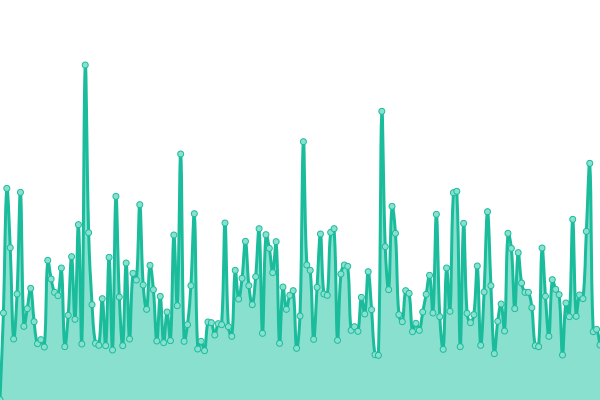
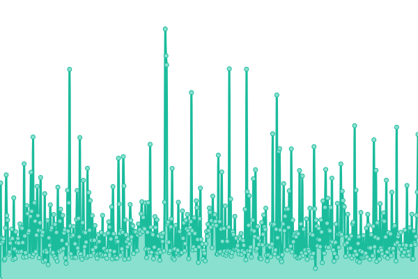
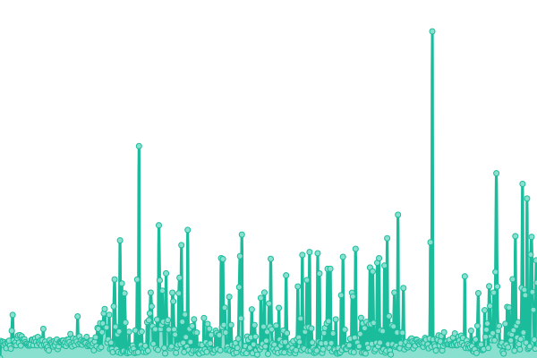
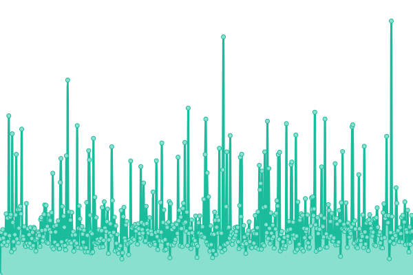
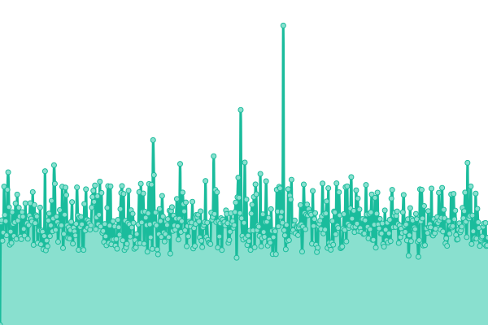
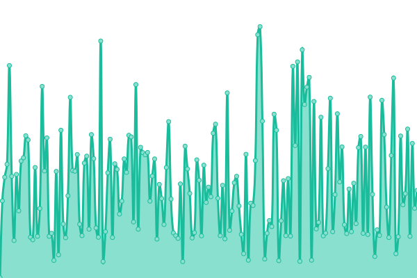
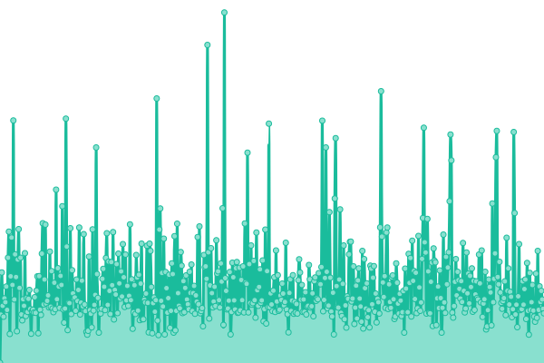
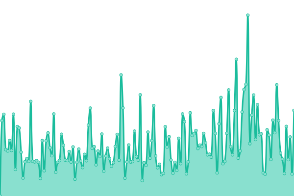
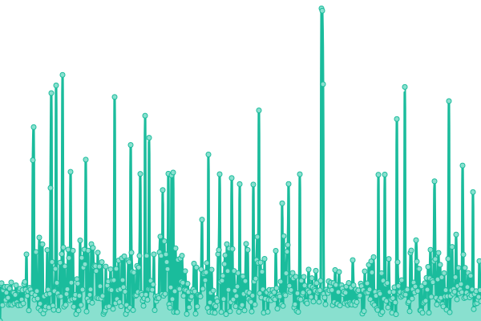
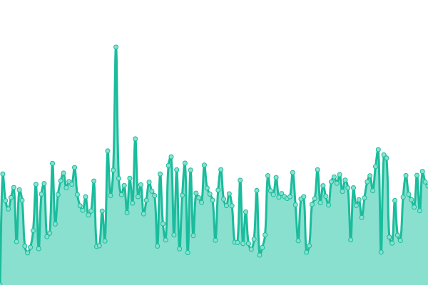

# [📈 Live Status](https://pmmmwh.github.io/upptime): <!--live status--> **🟧 Partial outage**

<!--start: status pages-->
<!-- This summary is generated by Upptime (https://github.com/upptime/upptime) -->
<!-- Do not edit this manually, your changes will be overwritten -->
<!-- prettier-ignore -->
| URL | Status | History | Response Time | Uptime |
| --- | ------ | ------- | ------------- | ------ |
|  [雙龍體育web](https://www.ssangyongsports.eu.org/) | 🟥 Down | [web.yml](https://github.com/sxadxsx/upptime/commits/HEAD/history/web.yml) | 

 206ms
     
 | 

<a href="https://sxadxsx.github.io/history/web">0.00%</a>
    

|  [雙龍職籃SBA](https://sbatw.ml/) | 🟥 Down | [sba.yml](https://github.com/sxadxsx/upptime/commits/HEAD/history/sba.yml) | 

 0ms
     
 | 

<a href="https://sxadxsx.github.io/history/sba">0.00%</a>
    

|  [雙龍職棒SLB](https://slbtw.cf/) | 🟥 Down | [slb.yml](https://github.com/sxadxsx/upptime/commits/HEAD/history/slb.yml) | 

 0ms
     
 | 

<a href="https://sxadxsx.github.io/history/slb">0.00%</a>
    

|  [雙龍體育blog](https://BLOG.ssangyongsports.eu.org/) | 🟥 Down | [blog.yml](https://github.com/sxadxsx/upptime/commits/HEAD/history/blog.yml) | 

 0ms
     
 | 

<a href="https://sxadxsx.github.io/history/blog">0.00%</a>
    

|  [雙龍體育社區community](http://community.ssangyongsports.eu.org/) | 🟥 Down | [community.yml](https://github.com/sxadxsx/upptime/commits/HEAD/history/community.yml) | 

 0ms
     
 | 

<a href="https://sxadxsx.github.io/history/community">0.00%</a>
    

|  [雙龍體育WIKI](https://wiki.ssangyongsports.eu.org/) | 🟥 Down | [wiki.yml](https://github.com/sxadxsx/upptime/commits/HEAD/history/wiki.yml) | 

 318ms
     
 | 

<a href="https://sxadxsx.github.io/history/wiki">0.00%</a>
    

|  [雙龍體育TV](https://watch.TV.ssangyongsports.eu.org/) | 🟥 Down | [tv.yml](https://github.com/sxadxsx/upptime/commits/HEAD/history/tv.yml) | 

 0ms
     
 | 

<a href="https://sxadxsx.github.io/history/tv">0.00%</a>
    

|  [雙龍體育IMG](http://IMG.ssangyongsports.eu.org/) | 🟩 Up | [img.yml](https://github.com/sxadxsx/upptime/commits/HEAD/history/img.yml) | 

 357ms
     
 | 

<a href="https://sxadxsx.github.io/history/img">0.00%</a>
    

|  [雙龍體育短網址url](http://ssport.cf) | 🟥 Down | [url.yml](https://github.com/sxadxsx/upptime/commits/HEAD/history/url.yml) | 

 0ms
     
 | 

<a href="https://sxadxsx.github.io/history/url">0.00%</a>
    

|  [雙龍體育購物Shop](https://ssangyongsports.easy.co/) | 🟩 Up | [shop.yml](https://github.com/sxadxsx/upptime/commits/HEAD/history/shop.yml) | 

 1114ms
     
 | 

<a href="https://sxadxsx.github.io/history/shop">100.00%</a>
    

<!--end: status pages-->
